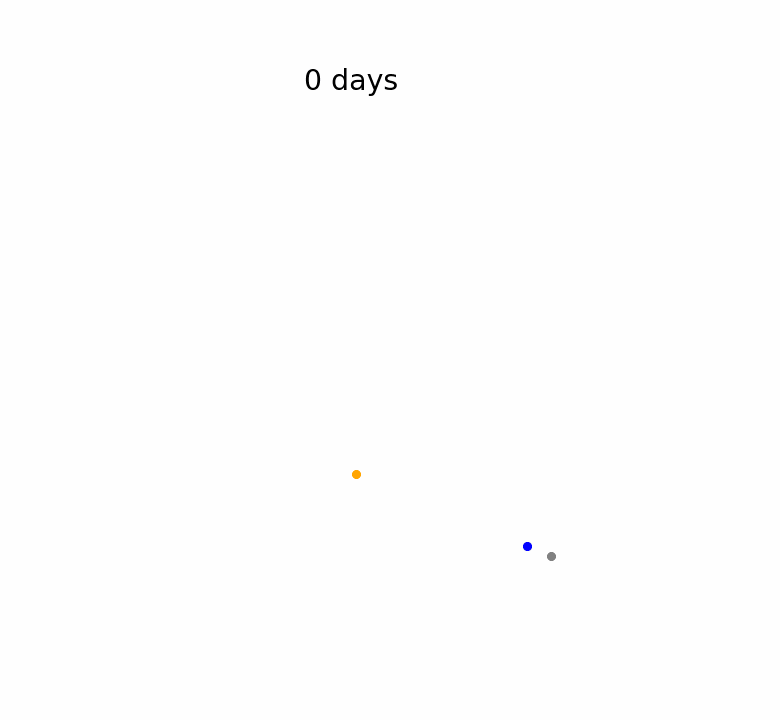

# Simulating gravitational interaction in python (Medium)

This repository has the codes that were explained in this medium article: [The article is not published yet]

In this repository, you can find 3 codes

1. **InteractionNbodies**
2. **plotAnimateNbodies**
3. **moonOrbitExaggerated**

**InteractionNbodies** calculates the positions and velocities of N bodies in gravitational interaction. You need to provide it with the initial and final points of the simulation, the number of bodies, their positions, velocities, masses, the number of steps in the simulation, and the folder to store the files. The results are then written to .txt files.

**plotAnimateNbodies** plots the data in a PDF and creates an animated GIF using the files generated by InteractionNbodies. The information you need to provide includes the file name, the folder where the files are located, the folder to store the graphs, the number of bodies, the number of steps, the total number of files for the entire simulation, and the names and colors of the bodies.

**moonOrbitExaggerated** is a script that exaggerates the moon's orbit for better visualization in the sun-earth-moon system. The required parameters include the file name, the folder where the files are located, the number of bodies, the total number of files for the entire simulation, and the names and colors of the bodies.

NOTE: In **InteractionNbodies**, the files are named as follows: "SEM_RK4_dt=0.00712890625_N=512000_exaggeratedMoon_P1Of1_POS." However, when passing the file name in **plotAnimateNbodies** and **moonOrbitExaggerated**, use only "SEM_RK4_dt=0.00712890625_N=512000_exaggeratedMoon."

Finally, throughout the codes InteractionNbodies and plotAnimateNbodies, you'll find pieces of code that are similar. You need to comment or uncomment them depending on whether you want to create the Sun-Earth-Moon system or a system with random bodies. There are comments "system" and "random bodies" that will guide you in distinguishing between the two.

Lastly, the **examples** folder contains figures and animations for reference.

Here is one of the examples available in the **examples** folder: the Sun-Earth-Moon system with an exaggerated moon orbit.

  

